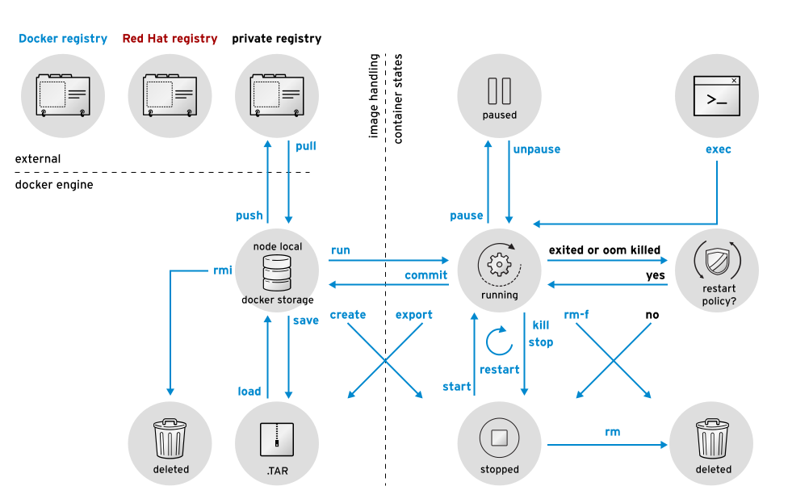

[//]: # (ToDo: add links to other articles)

This tutorial series aims to provide you with an introduction to container and container orchestration technology using Docker, Kubernetes, and Red Hat OpenShift Container Platform.

This tutorial is Part 3 of my series on Red Hat Openshift. Check out the other articles:

0. [Fundamentals of Containers, Kubernetes, and Red Hat OpenShift : Tutorial introduction][0]
1. [Setting Up the Lab Environment][1]
2. [Overview of the Docker Architecture][2]
3. [<span style="color:red">Managing the Life Cycle of Containers</span>][3]
4. [Building Custom Container Images with Dockerfile][4]
5. [Creating Kubernetes Resources][5]
6. [Creating Applications with Source-to-Image facility of Red Hat OpenShift][6]


Let's curry on with this section, we will se how to manage the life cycle of a container from creation to deletion.

## Docker Client Verbs
The Docker client, implemented by the docker command, provides a set of verbs to create and manage containers. The following figure shows a summary of the most commonly used verbs that change container state.  


{: .image-pull-right}

## Managing Containers

Docker provides the following commands to manage containers:

- **docker ps**: This command is responsible for listing running containers

```shell
$ docker ps -a
CONTAINER ID        IMAGE               COMMAND                 CREATED             STATUS                       PORTS               NAMES
4829d82fbbff        do180/httpd         "httpd -D FOREGROUND"   15 hours ago        Exited (0) 3 seconds ago                         my-httpd-container
```

- **docker inspect**: This command is responsible for listing metadata about a running or stopped container. The command produces a JSON output

```shell
$ docker inspect my-httpd-container

{
    "Id": "980e45b5376a4e966775fb49cbef47ee7bbd461be8bfd1a75c2cc5371676c8be",
...
    "NetworkSettings": {
        "Bridge": "",
        "EndpointID": "483fc91363e5d877ea8f9696854a1f14710a085c6719afc858792154905d801a",
        "Gateway": "172.17.42.1",
        "GlobalIPv6Address": "",
        "GlobalIPv6PrefixLen": 0,
        "HairpinMode": false,
        "IPAddress": "172.17.0.9",
...
}
```

- **docker stop**: This command is responsible for stopping a running container gracefully
- **docker kill**: This command is responsible for stopping a running container forcefully  
It is possible to specify the signal with the -s option 
```shell
docker kill -s SIGKILL my-httpd-container
```

- **docker restart**: This command is responsible for restarting a stopped container
- **docker rm**: This command is responsible for deleting a container, discarding its state and filesystem  
It is possible to delete all containers at the same time. The docker ps command has the -q option that returns only the ID of the containers.
```shell
$ docker stop $(docker ps -q)
$ docker rm $(docker ps -aq)
```

## Running Commands in a Container
When a container is created, a default command is executed according to what is specified by the container image. However, it may be necessary to execute other commands to manage the running container.  
The **docker exec** command starts an additional process inside a running container:
```shell
$ sudo docker exec -it my-httpd-container /bin/bash
$ root@665b4a1e17b6:/#
```
Now you have started a bash shell inside your container you can run any shell command on it.

##  Managing Container Images
- **docker save**: generates a file containing image metadata and preserves original image layers, so the original image can be later re-created exactly as it was.
```shell
docker save [-o FILE_NAME] IMAGE_NAME[:TAG]
```
- **docker load**: restore the container image from a file
```shell
docker load [-i FILE_NAME]
```
- **docker rmi**: delete an image from the cache
```shell
docker [OPTIONS] IMAGE
```
To delete all images that are not used by any container, use the following command:
```shell
 docker rmi $(docker images -q)
```
- **docker diff**: used to identify which files were changed, created, or deleted since the container was started
```shell
$ docker diff mysql-basic
C /run
C /run/mysqld
A /run/mysqld/mysqld.pid
A /run/mysqld/mysqld.sock
A /run/mysqld/mysqld.sock.lock
A /run/secrets
```  

    Any added file is marked with an A, and any changed file is marked with a C.

    To commit the changes to another image, run **docker commit**:
    ```shell
    $ docker commit mysql-basic mysql-custom
    ```

Playing with images and containers is cool but [building custom container images with Dockerfiles][4] is even more fun!

[0]: https://jerbiahmed.github.io/introduction
[1]: https://jerbiahmed.github.io/setting-up-openshift-lab
[2]: https://jerbiahmed.github.io/docker-overview/
[3]: https://jerbiahmed.github.io/docker-life-cycle
[4]: https://jerbiahmed.github.io/
[5]: https://jerbiahmed.github.io/
[6]: https://jerbiahmed.github.io/