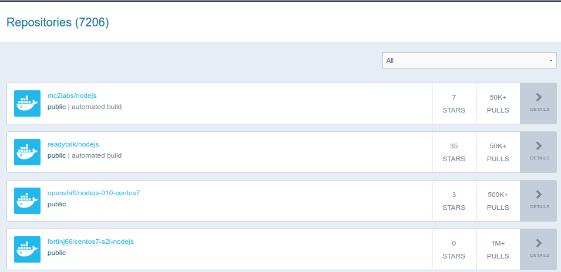
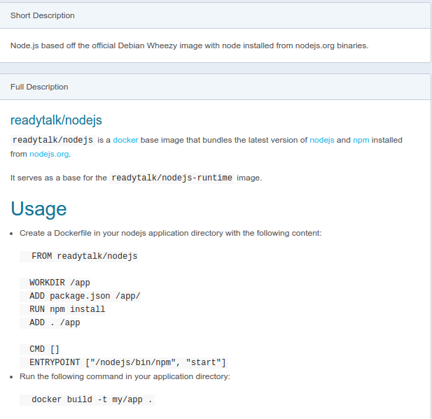

[//]: # (ToDo: add links to other articles)

This tutorial series aims to provide you with an introduction to container and container orchestration technology using Docker, Kubernetes, and Red Hat OpenShift Container Platform.

This tutorial is Part 2 of my series on Red Hat Openshift. Check out the other articles:

0. [Fundamentals of Containers, Kubernetes, and Red Hat OpenShift : Tutorial introduction][0]
1. [Setting Up the Lab Environment][1]
2. [<span style="color:red">Overview of the Docker Architecture</span>][2]
3. [Managing the Life Cycle of Containers][3]
4. [Building Custom Container Images with Dockerfile][4]
5. [Creating Kubernetes Resources][5]
6. [Creating Applications with Source-to-Image facility of Red Hat OpenShift][6]

## What is Docker
I'll just copy the definition from [opensource.com](https://opensource.com/resources/what-docker) 

>Docker is a tool that is designed to benefit both developers and system administrators, making it a part of many DevOps (developers + operations) toolchains. For developers, it means that they can focus on writing code without worrying about the system that it will ultimately be running on. It also allows them to get a head start by using one of thousands of programs already designed to run in a Docker container as a part of their application. For operations staff, Docker gives flexibility and potentially reduces the number of systems needed because of its small footprint and lower overhead.

Now let's fire up our lab and use the command-line to try out basic Docker commands with and begin to understand how it works.  
There is a beginners guide to Docker that introduces you to some basic commands and container terminology.
Start the cluster and ssh to the server.

```shell
$ minishift start
Starting local OpenShift cluster using 'virtualbox' hypervisor...
Registering machine using subscription-manager
-- Checking OpenShift client ... OK
-- Checking Docker client ... OK

 ... ommitted ...

-- Server Information ... 
   OpenShift server started.
   The server is accessible via web console at:
       https://192.168.99.100:8443

   You are logged in as:
       User:     developer
       Password: developer

   To login as administrator:
       oc login -u system:admin

$ minishift ssh
[docker@minishift ~]$
```
## Finding an Image

Many container images are available for download from the [DockerHub website](https://hub.docker.com/).  
It is a large repository where developers and administrators can get a number of container images developed by the community and some companies.  
Anyone can publish images to Docker Hub after they register.  
By default, Docker downloads image layers from the Docker Hub image registry however, there are many other registries like [Quay](https://quay.io/), Amazon's [EC2](https://aws.amazon.com/fr/ecr/), Google's [Container Registry](https://cloud.google.com/container-registry/) or even self-hosted [private registries](https://docs.docker.com/registry/deploying/).  

The Docker Hub search engine is a simple search engine. It looks for a project name from the Docker Hub registry.  
The search results page lists the string used to pull the image files. For example, for the following screen output, the first column is the name of the container image.



{: .image-pull-right}

Clicking an image name to display the container image details page. The details page is not guaranteed to display any particular information. Different authors provide different levels of information about the images they create.


{: .image-pull-right}

The docker command can also be used to search for container images:

```shell
docker search mysql
```

The search uses the Docker Hub registry and also any other registry configured in the local Docker daemon.


## Fetching an Image

To download an image from the Docker Hub container image registry, look for the first column name from the Docker Hub search results page, or the second column from the docker search command and use docker pull command:

```shell
sudo docker pull hello-world
```
Many versions of the same image can be provided. Each one receives a different tag name. 
If no tag name is provided, then docker pull assumes the tag called latest by default.

To download a specific tag, append the tag name to the image name separated by a colon (:) in the docker pull command:

```shell
sudo docker pull hello-world:latest
```

## Listing the Images Available in the Local

To list all images that were already downloaded by the local Docker daemon, use the docker images command:

```shell
$ sudo docker images

REPOSITORY                         TAG                 IMAGE ID            CREATED             VIRTUAL SIZE
docker.io/hello-world              latest              a5ad9eb2ff48        4 weeks ago         974 B
```
## Creating a Container from an image
To create and start a process within a new container, use the docker run command. The container is created from the container image name passed as argument.

```shell
$ sudo docker run hello-world

Hello from Docker!
This message shows that your installation appears to be working correctly.
```

## Guided Exercise: Creating a MySQL Database Instance
In this exercise, you will start a MySQL server inside a container, and then create and populate a database.

1. Create a MySQL server container instance:

    1.1. Open a shell inside the Minishift VM. All Docker commands will be run inside the VM:

    ```shell
    $ minishift start
    $ minishift ssh
    [docker@minishift ~] $
    ```

    1.2. Start a container from [the Docker Hub MySQL](https://hub.docker.com/_/mysql/) image:

    ```shell
    [docker@minishift ~]$ docker run --name mysql-basic -e MYSQL_USER=user1 -e MYSQL_PASSWORD=pass1 -e MYSQL_DATABASE=items -e MYSQL_ROOT_PASSWORD=root -d mysql:5.6
    ``` 

    Notice that we passed the -d to the docker run command to start a container image as a background process.  
    Also many container images require parameters to be started, such as the MySQL official image (read Environment Variables in the Docker hub image description).  
    They should be provided using the -e option from the docker command.

    This command downloads (pulls) the mysql container image with the **5.6** tag, and starts a container named **mysql-basic** based on it. The container runs in the background.  
    The mysql container image uses the environment variables passed to the docker run command to initialize a database named **items**, owned by a user named **user1**, with **pass1** as the password. The database administrator password is set to **root**.

    1.3. Check that the container started without errors.

    ```shell
    $ sudo docker ps | grep mysql
    CONTAINER ID    IMAGE       COMMAND                  CREATED            STATUS         PORTS      NAMES
    13568029202d    mysql:5.6   "docker-entrypoint.sh"   6 seconds ago      Up 4 seconds   3306/tcp   mysql-basic
    ```

2. Access the container sandbox by running the following command:

    ```shell
    $ docker exec -it mysql-basic bash
    root@13568029202d:/# 
    ```

    This will starts a Bash shell, running as root, inside the MySQL container.

3. Add data to the database:

    Log in to MySQL as the database administrator user (root) using the password we passed to docker run command

    ```shell
    mysql -proot
    ```

    The mysql command opens the MySQL database interactive prompt. Run the following command to check the items database availability:

    ```m
    mysql> show databases;
    +--------------------+
    | Database           |
    +--------------------+
    | information_schema |
    | items              |
    | mysql              |
    | performance_schema |
    +--------------------+
    4 rows in set (0.00 sec)
    ```

    Cool our mysql database is up and running , it took just 2 minutes to install an instance, configure and create the database.

4. Undo the changes made by the lab when you are finished

    4.1. Stop the running container by running the following command:

    ```shell
    [docker@minishift ~]$ docker stop mysql-basic
    ```

    4.2. Remove the data from the stopped container by running the following command:

    ```shell
    [docker@minishift ~]$ docker rm mysql-basic
    ```

    4.3. Remove the container image by running the following command:

    ```shell
    [docker@minishift ~]$ docker rmi mysql:5.6
    ```

    4.4. Leave the Minishift VM:

    ```shell
    [docker@minishift ~]$ exit
    logout
    $ minishift stop
 
    ```


## To recap
The base command for the Docker CLI discussed in this article:

```
docker search   # Search the Docker Hub for images
docker pull     # Pull an image or a repository from a registry
docker images   # List images
docker run      # Run a command in a new container
docker ps       # List containers
docker exec     # Run a command in a running container
docker stop     # Stop one or more running containers
docker rm       # Remove one or more containers
docker rmi      # Remove one or more images
```

 See also the full [Docker command line reference](https://docs.docker.com/engine/reference/commandline/docker/)


Now that you're able to run a container from an existing image, let's learn more about the [life Cycle of containers][3].


[0]: https://jerbiahmed.github.io/introduction
[1]: https://jerbiahmed.github.io/setting-up-openshift-lab
[2]: https://jerbiahmed.github.io/docker-overview/
[3]: https://jerbiahmed.github.io/docker-life-cycle
[4]: https://jerbiahmed.github.io/
[5]: https://jerbiahmed.github.io/
[6]: https://jerbiahmed.github.io/