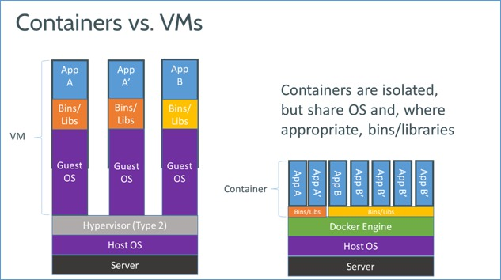

[//]: # (ToDo: add links to other articles)

Hello world!  
  
This serie will provide you with an introduction to container and container orchestration technology using Docker, Kubernetes, and Red Hat OpenShift Container Platform.  
You will learn how to containerize applications, test them using Docker, and deploy them on a Kubernetes cluster using Red Hat OpenShift.  
Additionally, you will build and deploy an application from source code using the Source-to-Image feature of OpenShift.

This tutorial is the introductory part of my series on Red Hat Openshift. Check out the other articles:
0. [Fundamentals of Containers, Kubernetes, and Red Hat OpenShift : Tutorial introduction][0]
1. [Setting Up the Lab Environment][1]
2. [Overview of the Docker Architecture][2]
3. [Managing the Life Cycle of Containers][3]
4. [Building Custom Container Images with Dockerfile][4]
5. [Creating Kubernetes Resources][5]
6. [Creating Applications with Source-to-Image facility of Red Hat OpenShift][6]

:exclamation:  **Spoiler Alert**  
 This part may seem very annoying if you're new to Docker and Kubernetes :sleeping:.  
Thus, it contains many definitions and concepts about the overall architecture .. just try read them quickly then come back here as you move on through the serie. 

Before we get our hands dirty we need to have some understanding of the global OpenShift architecture.  

## Containerized Applications

Software applications are typically deployed to an operating system with a set of services running, such as a database server or an HTTP server, but they can also be deployed to any environment that can provide the same services, such as a virtual machine or a physical host.  
If another application is sharing the same host OS and the same set of libraries, there might be a risk of breaking it if an update that fixes the first application libraries affects the second application.  
For a company developing typical software applications, any maintenance on the running environment might require a full set of tests to guarantee that any OS update does not affect the application as well.  
Depending on the complexity of an application, the regression verification might not be an easy task and might require a major project.

Alternatively, we can work with containers, which are a kind of isolated partition inside a single operating system.  
Containers provide many of the same benefits as virtual machines, such as security, storage, and network isolation, while requiring far fewer hardware resources and being quicker to launch and terminate. 

{: .image-pull-right}

  
They also isolate the libraries and the runtime environment (such as CPU and storage) used by an application to minimize the impact of any OS update to the host OS, as described in the previous diagram.  
  
There are many container providers available, such as Rocket, Drawbridge, and LXC, but the major provider is Docker.

### Advantages of Docker

**Low hardware usage**  
Docker uses OS internal features to create an isolated environment where resources are managed using OS facilities such as namespaces which minimizes the amount of CPU and memory overhead.  

**Environment isolation**  
Docker allows working in a closed environment where changes made to the host OS or other applications do not affect the container.

**Quick deployment**  
Docker deploys any container quickly because there is no need for a full OS install or restart.

**Reusability**  
The same container can be reused by multiple applications without the need to set up a full OS. 

## OpenShift and Kubernetes Terminology

Red Hat OpenShift Container Platform (OCP) is a set of components and services built on top of RHEL and Docker.  
OCP adds capabilities such as remote management, increased security, application life-cycle management, and self-service interfaces for developers.

{: .image-pull-right}

The basic container infrastructure is shown in the figure above:   

- The base OS is Red Hat Enterprise Linux (RHEL).
- Docker provides the basic container management and the container image file format.
- Kubernetes manages a cluster of hosts (physical or virtual) that run containers. It works with resources that describe multicontainer applications and how they interconnect.
- OCP-Kubernetes extensions are additional resource types managed by Kubernetes.
- Containerized services fulfill many infrastructure functions, such as networking and authorization.
- Runtimes and xPaaS are base container images ready for use by developers, each preconfigured with a particular runtime language or database.
- DevOps tools and user experience provides Web and CLI management tools for managing user applications and OCP services. The OpenShift Web and CLI tools are built from REST APIs which can be leveraged by external tools such as IDEs and CI platforms.

### Kubernetes Resource Types

Kubernetes has five main resource types that can be created and configured using a YAML or a JSON file, or using OpenShift management tools:

**Pods**  
Represent a collection of containers that share resources, such as IP addresses and persistent storage volumes. It is the basic unit of work for Kubernetes.  
**Services**  
Define a single IP/port combination that provides access to a pool of pods. By default, services connect clients to pods in a round-robin fashion.  
**Replication Controllers**  
A framework for defining pods that are meant to be horizontally scaled. A replication controller includes a pod definition that is to be replicated, and the pods created from it can be scheduled to different nodes.  
**Persistent Volumes (PV)**  
Provision persistent networked storage to pods that can be mounted inside a container to store data.  
**Persistent Volume Claims (PVC)**  
Represent a request for storage by a pod to Kubernetes.  

### OpenShift Resource Types

The main resource types added by OCP to Kubernetes are as follows:

**Deployment Configurations (dc)**  
Represent a set of pods created from the same container image, managing workflows such as rolling updates.  
A dc also provides a basic but extensible Continuous Delivery workflow.  
**Build Configurations (bc)**  
Used by the OpenShift Source-to-Image (S2I) feature to build a container image from application source code stored in a Git server.  
A bc works together with a dc to provide a basic but extensible Continuous Integration/Continuous Delivery workflow.  
**Routes**  
Represent a DNS host name recognized by the OpenShift router as an ingress point for applications and microservices.  
  
   
Here we've finally finished this chapter :triumph:  
Let's put this into practice and [set up a local lab][1].

[0]: https://jerbiahmed.github.io/introduction
[1]: https://jerbiahmed.github.io/setting-up-openshift-lab
[2]: https://jerbiahmed.github.io/docker-overview/
[3]: https://jerbiahmed.github.io/
[4]: https://jerbiahmed.github.io/
[5]: https://jerbiahmed.github.io/
[6]: https://jerbiahmed.github.io/
[7]: https://developers.redhat.com/products/cdk/download
[8]: https://github.com/openshift/origin/releases