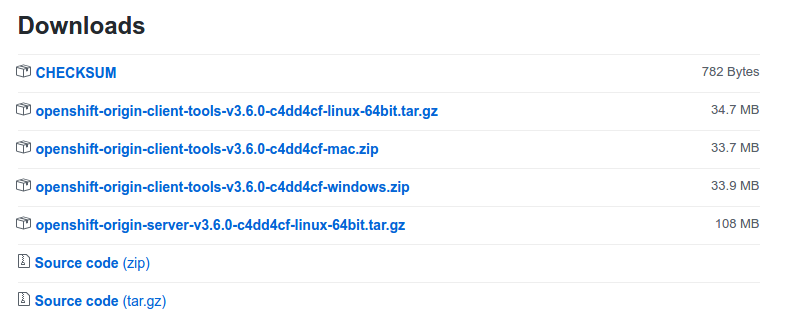

[//]: # (ToDo: add links to other articles)

This tutorial series aims to provide you with an introduction to container and container orchestration technology using Docker, Kubernetes, and Red Hat OpenShift Container Platform.

This tutorial is Part 1 of my series on Red Hat Openshift. Check out the other articles:
0. [Fundamentals of Containers, Kubernetes, and Red Hat OpenShift : Tutorial introduction][0]
1. [<span style="color:red">Setting Up the Lab Environment</span>][1]
2. [Overview of the Docker Architecture][2]
3. [Managing the Life Cycle of Containers][3]
4. [Building Custom Container Images with Dockerfile][4]
5. [Creating Kubernetes Resources][5]
6. [Creating Applications with Source-to-Image facility of Red Hat OpenShift][6]

# Setting Up the Lab Environment

This serie includes a number of guided exercises, which give you an opportunity to practice the skills you are learning. To complete these exercises, you need to configure a practice environment that you completely control.

The installation of the lab environment consists of the following tasks:
1. Install Oracle VirtualBox to serve as a virtualization manager for Red Hat CDK .
2. Install Red Hat CDK 3.
3. Install OpenShift Origin CLI
4. Starting an OpenShift cluster.


## Install Oracle VirtualBox

```shell
wget -q -O- http://download.virtualbox.org/virtualbox/debian/oracle_vbox_2016.asc | sudo apt-key add -
sh -c 'echo "deb http://download.virtualbox.org/virtualbox/debian $(lsb_release -sc) contrib" | sudo tee /etc/apt/sources.list.d/virtualbox.list'
sudo apt update
sudo apt-get install virtualbox-5.1
```
## Install RED HAT CDK 3

Download the Red Hat Container Development Kit 3 from [here][7], you may need to login or to create a Red Hat developer account if you don't have one already.  
Download the appropriate package for the operating system then rename the downloaded file to **`minishift​`** and copy the binary file to **`/usr/local/bin`​** or another directory that is accessible in your command-shell path.  

### On Linux 

```shell
sudo mv cdk-3.1.1-1-minishift-linux-amd64 /usr/local/bin/minishift
sudo chmod +x /usr/local/bin/minishift
```

### On Windows

Rename your file to **minishift.exe** and add its directory to path env variable.

## Install OpenShift Origin CLI

Get the last release of OpenShift Origin client from its [GitHub repository][8].


{: .image-pull-right}

Unpack the package for your OS , rename the oc binary and add it to system path.

### On Linux 

```shell
tar -xzf openshift-origin-client-tools-v3.6.0-c4dd4cf-linux-64bit.tar.gz -C .
cd openshift-origin-client-tools-v3.6.0-c4dd4cf-linux-64bit/
sudo mv oc /usr/local/bin/oc
sudo chmod +x /usr/local/bin/oc
```

### On Windows

Unpack, rename your file to **oc.exe** then place it in the same directory as minishift.exe.

## Configure and run Openshift

First we need to change two persistent configuration options as we will use the virtualbox driver and will allocate 2 GB of RAM which should be enough for our lab.

### On Linux 

```shell
minishift setup-cdk
minishift config set vm-driver virtualbox
minishift config set memory 2048
```

### On Windows

Open a powershell and browse to minishift.exe path then run it.

```shell
cd c:/minishift
./minishift.exe setup-cdk
./minishift.exe config set vm-driver virtualbox
./minishift.exe config set memory 2048
```
The minishift config​ command may issue a warning message, "No Minishift instance exists…".
This message can safely be ignored.  
Execute the following command to start an OpenShift cluster when prompted enter your Red Hat developer account credentials.

### On Linux 

```shell
minishift start
```
### On Windows

```shell
./minishift.exe start

Starting local OpenShift cluster using 'virtualbox' hypervisor...
Registering machine using subscription-manager
Red Hat Developers or Red Hat Subscription Management (RHSM) username: jerbia7med
Red Hat Developers or Red Hat Subscription Management (RHSM) password: [HIDDEN]
Registration successful [53.4s]
Starting OpenShift using registry.access.redhat.com/openshift3/ose:v3.6.173.0.5 ...
OpenShift server started.

The server is accessible via web console at:
    https://192.168.99.100:8443
```

Your local OpenShift server is now up and running,you can check its web console by browsing to https://192.168.99.100:8443 .

Now that we verified our installation is OK let's stop the cluster and reduce some memory usage, I know your computer is overheating :fire::fire::fire:

### On Linux 

```shell
minishift stop
```
### On Windows

```shell
./minishift.exe stop
```


Our lab is ready,the next article in this tutorial series will explore the [Docker architecture][2].  
Ready? [Click here][2]!

[0]: https://jerbiahmed.github.io/introduction
[1]: https://jerbiahmed.github.io/setting-up-openshift-lab
[2]: https://jerbiahmed.github.io/
[3]: https://jerbiahmed.github.io/
[4]: https://jerbiahmed.github.io/
[5]: https://jerbiahmed.github.io/
[6]: https://jerbiahmed.github.io/
[7]: https://developers.redhat.com/products/cdk/download
[8]: https://github.com/openshift/origin/releases