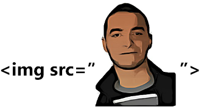

{: .image-pull-right}

/* TODO: Add a quote or a proverb, everybody does that in their blog! */

<b>-- Me </b> .

## About

Hello world!  

This is Ahmed Jerbi :hand:  
I'm currently doing continuous integration/delivery engineering with DevOps focus.  
Most of the time I write shell scripts ansible playbooks and dockerfiles, building jenkins jobs, automating software pipelines and  managing clusters with Openshift.  
In the past, I did node.js (still love it :heart:) and PHP mostly with Symfony also in my education at the university I wrote JAVA, Python, C++ ..

What are non-tech things am I doing?  
Mostly sleeping :no_mouth:  
Well, all the boring stuff like watching sports on TV or playing games.  
I also want to make music, in particular techno and trance ..  but never got to pass the first notes :laughing::laughing::laughing:

Enjoy your stay :wink:  

Ahmed
